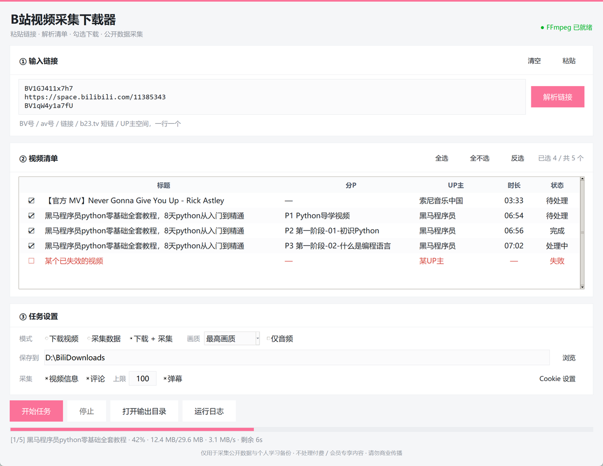

# BiliCrawler · B站视频采集下载器

> Windows 桌面工具。**先解析、再勾选、最后下载**——粘贴链接后先看到完整清单，确认无误才动手。

[](https://github.com/<your-name>/bili-crawler/releases)
[](https://www.python.org/)
[](https://docs.python.org/3/library/tkinter.html)
[](LICENSE)



---

## 目录

- [它是什么](#它是什么)
- [功能特性](#功能特性)
- [合规声明](#合规声明)
- [快速开始](#快速开始)
- [使用说明](#使用说明)
- [从源码构建](#从源码构建)
- [技术笔记](#技术笔记)
- [项目结构](#项目结构)
- [常见问题](#常见问题)
- [依赖与致谢](#依赖与致谢)
- [License](#license)

---

## 它是什么

一个 tkinter 写的 Windows 桌面小工具，做两件事：

1. **下载** B 站公开投稿视频（含分P、UP 主投稿批量）
2. **采集** 公开数据：视频信息 / 评论 / 弹幕，输出 JSON

和多数「粘贴链接就直接开下」的脚本不同，它是**两段式**的：

```
粘贴链接  →  点「解析链接」  →  清单里逐条勾选  →  开始任务
                ↑
        多P、UP主投稿在这里全部展开
```

这样多P 教程、UP 主几十个投稿不会一股脑全下下来，也不会下到已失效的条目。

---

## 功能特性

### 下载

- 支持 **BV 号 / av 号 / 完整链接 / b23.tv 短链 / UP 主空间链接**，一行一个，可整段粘贴
- **多P 视频自动拆成 P1 / P2 / P3…** 逐条列出，可单独勾选
- UP 主空间链接自动展开最近 60 个投稿
- 清晰度：最高画质 / 1080P / 720P / 480P / 360P，或**仅音频**
- 内置 FFmpeg，自动合并音视频、按标题命名
- 实时进度：百分比、已下载大小、速度、剩余时间

### 采集

结果输出到 `<保存目录>\_采集数据\` 下的 JSON：

| 字段 | 内容 |
|---|---|
| `video` | 标题、UP主、时长、播放/点赞/投币/收藏/弹幕数、发布时间、简介、分P列表 |
| `comments` | 评论人、UID、内容、点赞数、时间；按热度翻页，可设条数上限 |
| `danmaku` | 全量弹幕：出现时间点、类型、字号、颜色、发送者、内容 |

### 界面

- 清单区可勾选 / 全选 / 全不选 / 反选，卡片标题右侧实时显示「已选 N / 共 M」
- 失败条目（视频已失效、需登录）自动标红并跳过
- 运行日志独立窗口，可随时查看、清空
- 适配 Windows 高 DPI（200% 缩放下不糊不乱）

---

## 合规声明

**本项目仅用于公开数据采集与个人学习备份。**

明确**不做**：

- ❌ 付费课程、大会员专享、番剧等版权保护内容
- ❌ 去水印、破解、绕过权限
- ❌ 任何形式的搬运与商业传播

使用者需自行遵守《中华人民共和国著作权法》与哔哩哔哩用户协议。程序内置了温和的请求限速，请勿用于高频批量抓取。

本项目与哔哩哔哩（bilibili）官方无任何关联。

---

## 快速开始

### 方式一：用安装包（推荐）

1. 到 [Releases](https://github.com/<your-name>/bili-crawler/releases) 下载 `BiliCrawler-x.x.x-Setup.exe`
2. 双击运行，向导里**保持 FFmpeg 组件勾选**（高清晰度必须靠它合并音视频）
3. 默认装到 `D:\Program Files\BiliCrawler`（无 D 盘则退回 `Program Files`）
4. 装完自动生成桌面 / 开始菜单快捷方式

### 方式二：免安装绿色版

解压 `dist\BiliCrawler\` 整个目录，双击 `BiliCrawler.exe` 即可。FFmpeg 需要手动放到
`ffmpeg\bin\ffmpeg.exe`（相对 exe 所在目录）。

### 方式三：直接跑源码

```bash
git clone https://github.com/biolmz/bili-crawler.git
cd bili-crawler
pip install yt-dlp requests
python src/app.py
```

> 必须使用带 `tkinter` 的 Python。Windows 官方安装包默认包含；
> 部分精简版 / conda 精简环境可能缺失，报 `ModuleNotFoundError: tkinter` 就换一个 Python。

---

## 使用说明

### 1. 粘贴链接

地址栏支持这些写法，一行一个：

| 写法 | 说明 |
|---|---|
| `BV1GJ411x7h7` | BV 号，最常用 |
| `av80433022` | 旧版 av 号 |
| `https://www.bilibili.com/video/BV...` | 完整链接，带 `?p=2` 会自动定位分P |
| `https://b23.tv/xxxxx` | 手机分享短链，自动跳转解析 |
| `https://space.bilibili.com/123456` | UP 主空间，自动拉取最近 60 个投稿 |

### 2. 点「解析链接」

程序会把每个链接**展开成一条条具体的视频/分P**列在清单里。
多P 视频会变成 `P1 …` / `P2 …` / `P3 …` 多行。

> 这一步只读取公开元数据，**不会下载任何视频**。

### 3. 勾选要处理的条目

- 点每行最左边的 `☑ / ☐` 单独切换
- 卡片右上角有 **全选 / 全不选 / 反选**
- 显示「失败」的行不参与勾选（视频已删或需登录）

### 4. 设置任务

| 模式 | 产出 |
|---|---|
| **下载视频** | MP4 文件（H.264 + AAC），存到保存目录根下 |
| **采集数据** | JSON 文件，存到 `<保存目录>\_采集数据\` |
| **下载 + 采集** | 上面两份一起产出 |

**画质**：最高画质 / 1080P / 720P / 480P / 360P，或勾「仅音频」。

### 5. 点「开始任务」

进度条与状态栏显示当前条目、百分比、速度、剩余时间。「运行日志」按钮可查看完整日志。

### 关于 Cookie（可选）

不填也能用。填了之后评论采集、UP 主投稿、高码率视频会更稳定。

获取方式：浏览器登录 B 站 → `F12` → `Application` → `Cookies` → `www.bilibili.com`
→ 复制 `SESSDATA` 的值 → 界面点「Cookie 设置」粘贴进去。

**只保存在本机**（`%LOCALAPPDATA%\BiliCrawler\cookie.txt`），不会上传到任何地方。

---

## 从源码构建

### 环境准备

```bash
# 需要带 tkinter 的 Python 3.10+
python -m venv .venv
.venv/Scripts/pip install yt-dlp requests pyinstaller
```

### 1. 生成图标

```bash
.venv/Scripts/python gen_icon.py
```

纯标准库手写的 ICO 生成脚本，输出 `assets/app.ico`。

### 2. 下载 FFmpeg

放到 `assets/ffmpeg/bin/ffmpeg.exe`。构建脚本会把它一起打进安装包。

### 3. 打包 exe

```bash
.venv/Scripts/pyinstaller --noconfirm --clean --windowed --name BiliCrawler \
  --icon assets/app.ico --distpath dist --workpath build \
  --collect-all yt_dlp --paths src src/app.py
```

> ⚠️ `--icon` 和 `--paths` 建议传**绝对路径**，否则配合 `--specpath` 时相对路径会错位。

### 4. 编译安装包

```bash
tools/nsis-3.10/Bin/makensis.exe installer/setup.nsi
```

产物在 `release/BiliCrawler-<版本>-Setup.exe`。

**两个坑**：

- `installer/setup.nsi` 含中文，**必须存为 UTF-8 with BOM**，否则编译出来乱码
- 不要用 `InstallDirRegKey`，它会覆盖命令行传入的 `/D=`；默认目录在 `.onInit` 里手动判断

### 自测

```bash
python src/app.py            # 源码调试
python test_core.py          # 核心模块自测（wbi 签名 / 弹幕解压 / 接口连通）
```

---

## 技术笔记

踩过的坑，攒在这里给后来人省时间。

### wbi 签名

B 站 2023 年起给多数 web 接口加了 wbi 签名校验。流程：

1. 请求 `nav` 接口拿到 `img_key` / `sub_key`
2. 两张 key 按固定的 `MIXIN_KEY_ENC_TAB` 重排，取前 32 位得到 `mixin_key`
3. 参数按 key 排序拼成 query，和 `mixin_key` 拼接后取 MD5 作为 `w_rid`

**关键细节**：拼接前必须把参数值里的 `!'()*` 全部剔除，否则签名永远对不上。
实现见 `src/bili_core.py` 的 `BiliSession`。签名 12 小时有效，过期要重新取。

### 弹幕是裸 deflate 流

`/x/v1/dm/list.so` 返回的数据是**裸 deflate**（没有 zlib 头），
requests 的自动解压处理不了，必须手动：

```python
zlib.decompress(data, -15)   # wbits=-15 → 裸 deflate
```

### 编码优先级必须锁 H.264

B 站同一分辨率会同时给出 `avc1`(H.264) / `hev1`(HEVC) / `av01`(AV1) 三种编码。
yt-dlp 默认按码率挑，经常挑到 **AV1** —— 体积最小，但大量播放器和剪辑软件打不开。

所以必须显式约束：

```python
format_sort=["vcodec:h264", "res", "br", "size"]
# format 表达式里再加 [vcodec^=avc1] 优先
```

### FFmpeg 是硬依赖

B 站只提供 DASH 分离流（画面和音轨分开），**没有 FFmpeg 连 360P 都下不了**。
所以安装包直接内置，不做「可选」处理。

### 高 DPI

tkinter 不会自动跟随系统缩放。200% 缩放的屏幕上，所有像素尺寸都要跟着放大：

```python
dpi = windll.gdi32.GetDeviceCaps(hdc, 88)   # LOGPIXELSX
SCALE = max(1.0, min(dpi / 96.0, 3.0))
def S(v): return int(round(v * SCALE))
```

然后 padding / 列宽 / 行高 / 进度条厚度全部用 `S()` 包一层。

### 其他

- **限速与风控**：请求间做了温和延时；触发 `-352` 时提示用户填 Cookie
- **打包后 CLI 卡死**：PyInstaller `--windowed` 的程序里跑
  `subprocess.run(capture_output=True)` 会因为管道句柄不释放而卡住，
  测试时要加 `timeout` 或干脆不捕获输出

---

## 项目结构

```
bili-crawler/
├─ src/
│  ├─ bili_core.py        核心：接口调用、wbi 签名、采集、yt-dlp 下载（不依赖 GUI，可单独当库用）
│  └─ app.py              tkinter 图形界面
├─ installer/
│  └─ setup.nsi           NSIS 安装包脚本（UTF-8 with BOM）
├─ assets/
│  ├─ app.ico             程序图标（gen_icon.py 生成）
│  ├─ ui-preview.png      界面截图（README 用）
│  └─ ffmpeg/bin/         FFmpeg（构建时一并部署，非 PyInstaller 内嵌）
├─ tools/nsis-3.10/       NSIS 编译器（便携版）
├─ gen_icon.py            纯标准库生成 ICO
├─ test_core.py           核心模块自测
├─ 使用说明.html          图文使用手册
├─ LICENSE                代码 MIT 许可
├─ LICENSE.txt            使用免责声明（GBK，安装包向导的许可页）
└─ DISCLAIMER.md          使用免责声明（UTF-8，内容与 LICENSE.txt 一致）
```

`src/bili_core.py` 是刻意做成**不依赖 tkinter** 的，可以单独 import 当爬虫库用：

```python
from bili_core import BiliClient

cli = BiliClient(cookie="")
refs = cli.resolve_input("https://www.bilibili.com/video/BV1GJ411x7h7")
info = cli.video_info(refs[0])
print(info.title, len(info.pages))
```

---

## 常见问题

**Q：提示「需要 FFmpeg」？**
安装时勾选了 FFmpeg 组件就不会出现。绿色版需要手动把 `ffmpeg.exe` 放到 `ffmpeg\bin\` 下。

**Q：评论 / 弹幕拉不到，提示风控（-352）？**
B 站对未登录请求有限流。点「Cookie 设置」填 `SESSDATA` 即可，见上文。

**Q：一个链接里有好几个视频怎么办？**
点「解析链接」后它们会全部展开成清单里的行，逐条勾选即可。

**Q：清单里显示「失败」的条目是什么？**
该视频已失效、被删除或需要登录。这类条目不参与勾选，直接跳过，不影响其他条目。

**Q：卸载后我下载的视频会丢吗？**
不会。视频存在你自己选的保存目录，卸载只删程序本身。

**Q：能一次性下 UP 主全部投稿吗？**
粘贴空间链接会自动展开最近 60 个。更深的分页需要手动补充链接。

**Q：下下来的文件比网页显示的大？**
因为优先选了 H.264 高码率版本以保证兼容性。想要小体积可以选更低清晰度，或「仅音频」。

---

## 依赖与致谢

| 组件 | 用途 | 许可 |
|---|---|---|
| [yt-dlp](https://github.com/yt-dlp/yt-dlp) | 下载内核 | Unlicense |
| [FFmpeg](https://ffmpeg.org/) | 音视频合并 | LGPL / GPL |
| [requests](https://github.com/psf/requests) | HTTP 请求 | Apache-2.0 |
| [NSIS](https://nsis.sourceforge.io/) | 安装包编译 | zlib / libpng |

界面上没有引入任何第三方 GUI 组件——全部用 tkinter 标准库手写，
目的是让打包体积可控、启动不依赖额外运行时。

---

## License

代码采用 [MIT 许可](LICENSE)。

[LICENSE.txt](LICENSE.txt) / [DISCLAIMER.md](DISCLAIMER.md) 是**使用免责声明**，
同时也是安装包向导里展示的许可页，与代码许可相互独立 —— 开源的是代码，
但用它去做什么，责任在使用者。

> `LICENSE.txt` 为 GBK 编码（NSIS 向导页需要），在 GitHub 网页上会显示为乱码，
> 请以 UTF-8 的 `DISCLAIMER.md` 为准。
